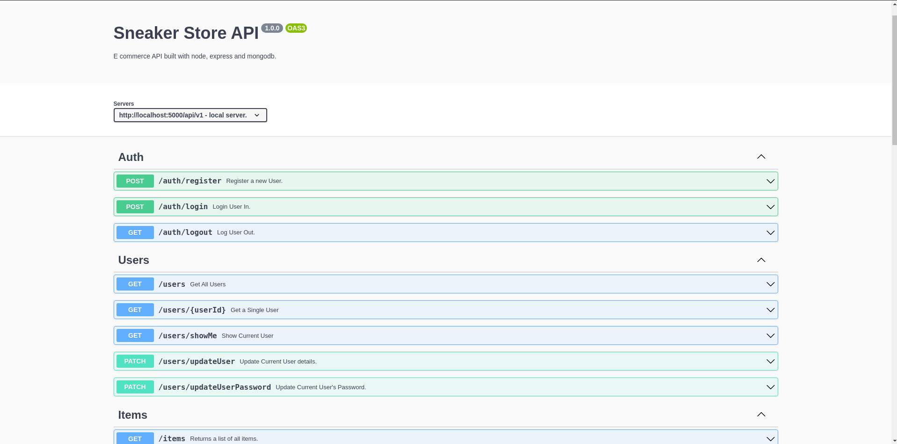

## Sneaker Store API

An e-commerce API built with node, express and mongodb.

### Screenshot



### Links

- Solution URL: [Sneaker Store](https://sneaker-store-api.herokuapp.com/api-docs/)


In order to spin up the project, in the root create .env with these two variables, with your own values.

* MONGO_URI 
* JWT_SECRET
* JWT_LIFETIME
* CLOUDINARY API NAME
* CLOUDINARY API KEY
* CLOUDINARY API SECRET

### To use the API locally, clone the api with
```bash
    git clone https://github.com/olad5/sneakers-store-api
```

```bash
    npm install && npm start
```

